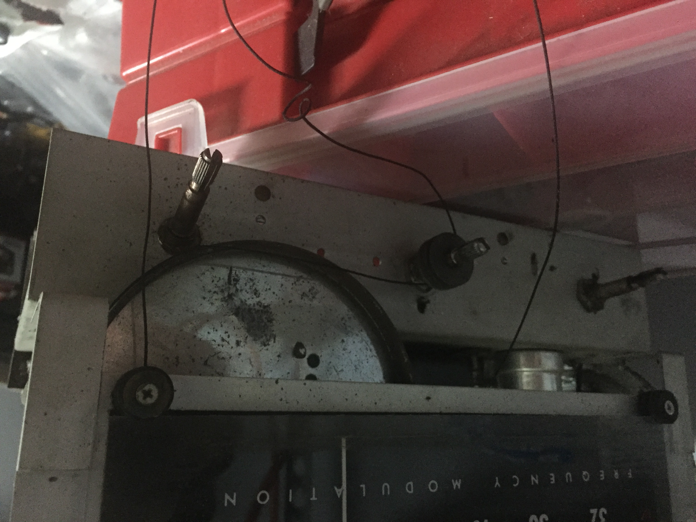
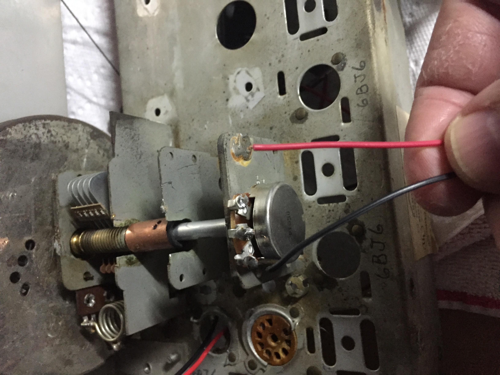

# retro-radio

## Overview

Initially, the idea was pretty simple: Have a dedicated raspberry pi to manage and play some pre-configured streams.
I had written a simple web interface that controlled a [Music Player Daemon](https://www.musicpd.org/) instance, 
plugged a powered speaker into it, and all was well.  Until I decided I wanted it to look more like a real radio, that is.

## Hardware

I ended up finding a beat-up, non-functioning 
[Regency Monitoradio (circa 1956)](https://commons.wikimedia.org/wiki/File:Vintage_Monitoradio_By_Regency,_Model_MR-10,_FM_Receiver,_8_Tubes,_Metal_Case,_Circa_1956_(15096254696).jpg) 
at a flea market. I initially planned on just gutting it, cleaning it up, and sticking the pi and speaker in it.  
Before I even got it home, scope-creep set in.  I thought it would be cool to control the power with the original 
radio controls.  Since I would already need to hook it up to the on/off/volume potentiometer for that, I might as well 
see if I could get the volume knob to work.  And I might as well see if I could simulate using the tuner knob to choose 
stations while I'm at it.

At this point, I decided I wanted to try to keep as much of the feel of the existing controls as I could.  So I 
decided to try to use the original 60+ year old potentiometers for the volume and squelch.  I cleaned them
up as good as I could and connected them to the pi.  Suprisingly, they worked well enough.  Polling them would produce 
pretty consistent results, but every so often, a reading would be far from the actual value.  I decided I'd try to mitigate 
this in the software, and stuck with the original pots, which are still in place today.

The tuner was more interesting.  The first issue was that the tuning shaft was broken, and the string had fallen off.

Fixing the shaft was easy.  Figuring out how to wind the string around everything was a complete puzzle.  Once I got
the string back on, I needed to figure out how to connect a new potentiometer to the shaft that controlled the tuning.
I ended up buying a potentiometer with a shaft, then connecting it to the existing radio's shaft with a coupler, so that
turning the radio shaft ends up turning the potentiometer.

With all 3 potentiometers hooked up, I got two white led lights to illuminate the tuner area and connected them to the pi. 
With that, everything was connected.

## Software

The backend is a spring boot application, initially written in groovy, but then converted to kotlin at some point along the way. It
scans the potentiometers for changes and acts on them and controls a [Music Player Daemon](https://www.musicpd.org/) instance for all 
audio functionality.  It also provides a RESTful API so that the webapp can configure and control the radio as well.

### Tuning Knob
I wanted to make it so turning the tuner made it behave like tuning an actual radio, so I'd need to simlulate what it was like
moving the knob, listening to static, and then honing in on a station.  Stations would be recognized at certain potentiometer values 
and when outside those values, rather than having MPD play the radio stream, it would play static.  I originally planned on using FM static, but it wasn't as interesting
as some of the other static samples I found.

<video width="640" controls>
  <source src="./videos/tuner.mp4" type="video/mp4">
  Your browser does not support the video tag.
</video>

### Volume Knob
I expected this one to be simple:  When the value of the volume potentiometer changed, pass the new value along to the MPD instance,
and that would be that.
But what I found when playing with it was that the volume didn't seem to increase naturally when turning the knob.  After 
logging the potentiometer values and watching them change as I turned the pot, I realized that the volume potentiometer was 
producing logarithmic values, as this seems more natural to the human ear as volume increases.  The issue is that
software like MPD already takes this into account.  If you pass it values that increase linearly,
it's already internally adjusting it logarithmically.  So in this case, the logarithmic adjustment was happening twice.  
I looked for ways to ask MPD to not do this, and apparently there are some ways that involve bypassing MPD's volume controls
and routing them elsewhere.  As I only wanted the application to have
to deal with MPD for all audio, I decided to just deal with this in software.  This meant that I needed 
to perform a calculation on the values coming from the volume pot to make read linearly, then pass that value to the MPD instance.

### Squelch
Well, there is no squelch needed in this simulation. Squelch basically acted like a gate to keep noise down back in the day.  So, 
I figured I'd repurpose it for something useful in this scenario.  After toying around with a few different ideas, I ended up deciding
it would be cool to use it to announce the currently playing artist, song, and station.  I looked around for voice synthesis
libraries for the pi, but then changed direction and decided to see if there were any sites with any type of web API that would 
convert a small blob of text to sound, and found [Voice RSS](http://www.voicerss.org/) which does exactly that.  When the squelch
pot is rotated, it just fires of an HTTP request to VoiceRSS with the text of the current artist, song, and station, and plays
what is returned.

[Video Demonstration of this]

For the web-app, I was initially planning on
Change stations without having to reach over to the radio
Test and configure new streams
Calibrate 