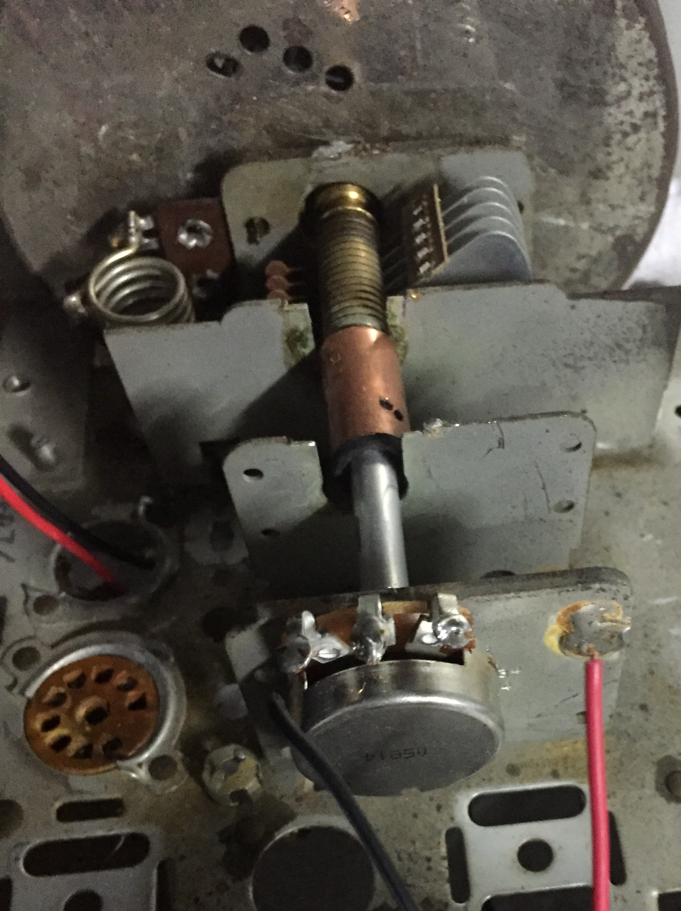
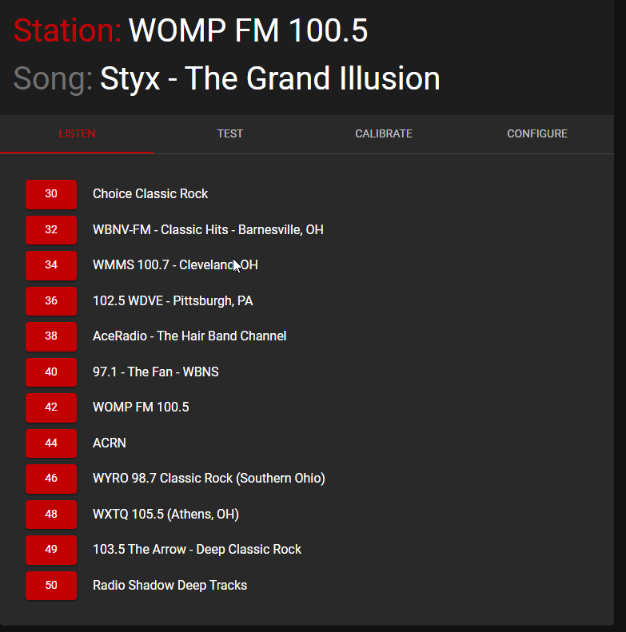

# retro-radio

## Overview

Initially, the idea was pretty simple: Have a dedicated raspberry pi to manage and play some pre-configured streams.
I had written a simple web interface that controlled a [Music Player Daemon](https://www.musicpd.org/) instance, 
plugged a powered speaker into it, and all was well.  Until I decided I wanted it to look more like a real radio, that is.

## Hardware

I ended up finding a beat-up, non-functioning 
[Regency Monitoradio (circa 1956)](https://commons.wikimedia.org/wiki/File:Vintage_Monitoradio_By_Regency,_Model_MR-10,_FM_Receiver,_8_Tubes,_Metal_Case,_Circa_1956_(15096254696).jpg) 
at a flea market. The plan was to gut it, clean it up, and stick the pi and speaker in it.  

Before I even got it home, scope-creep set in.  I thought it would be cool to control the power to the pi with the original 
radio controls.  Since I would already need to hook it up to the on/off/volume potentiometer for that, I might as well 
see if I could get the volume knob to work.  And I might as well see if I could simulate using the tuner knob to choose 
stations while I'm at it.

I eneded up deciding to try to keep as much of the feel of the existing controls as I could.  So I 
figured I'd attempt use the original 60+ year old potentiometers for the volume and squelch.  I cleaned them
up as good as I could and connected them to the pi.  Surprisingly, they worked well enough.  Polling them would produce 
mostly consistent results, but every so often, a reading would be far from the actual value.  I decided I'd try to mitigate 
this in the software, and stuck with the original pots, which are still in place today.

The tuner was more interesting.  The first issue was that the tuning shaft was broken, and the string had fallen off.

Fixing the shaft was easy.  Figuring out how to wind the string around everything was a bit of a puzzle.  After tracing a bunch
of different paths, I "wound" up with [this](./images/string.png).

With the string back on, I needed to figure out how to connect a new potentiometer to the original tuning shaft.
I ended up buying a potentiometer that had its own shaft, then connecting it to the existing radio's shaft with a coupler, so that
turning the radio shaft ends up turning the potentiometer.

[//]: # (![Potentiometer fused with radio tuner shaft]&#40;./images/shaft-connected.jpg&#41;)

With all 3 potentiometers hooked up, I got two white led lights to illuminate the tuner area and connected them to the pi. 
With that, everything was connected.

## Software

The [backend is a spring boot application](https://github.com/mboyers/pi-radio), initially written in groovy, but then converted to kotlin at some point along the way. It
scans the potentiometers for changes and acts on them and controls a [Music Player Daemon](https://www.musicpd.org/) instance for all 
audio functionality.  It also provides a RESTful API so that the webapp can configure and control the radio as well.

### Tuning Knob
I wanted to make it so turning the tuner made it behave like tuning an actual radio, so I'd need to simlulate what it was like
moving the knob, listening to static, and then honing in on a station.  Stations would be recognized at certain potentiometer values 
and when outside those values, rather than having MPD play the radio stream, it would play static.

### Volume Knob
I expected this one to be simple:  When the value of the volume potentiometer changed, pass the new value along to the MPD instance,
and that would be that.

But what I found when playing with it was that the volume didn't seem to increase naturally when turning the knob.  After 
logging the potentiometer values and watching them change as I turned the pot, I realized that the volume potentiometer was 
producing logarithmic values, as this seems more natural to the human ear as volume increases.  The issue is that
software like MPD already takes this into account.  If you pass it values that increase linearly,
it's already internally adjusting it logarithmically.  So in this case, the logarithmic adjustment was happening twice.  

I looked for ways to ask MPD to not do this, and apparently there are some ways that involve bypassing MPD's volume controls
and routing them elsewhere.  As I only wanted the application to have to deal with MPD for all audio, I decided to just deal with this 
in software.  This meant that I needed to perform a calculation on the values coming from the volume pot to make read linearly, 
then pass that value to the MPD instance.

### Squelch
Well, there is no squelch needed in this simulation. Squelch basically acted like a gate to keep noise down back in the day.  So, 
I figured I'd repurpose it for something useful in this scenario.  After toying around with a few different ideas, I ended up deciding
it would be cool to use it to announce the currently playing artist, song, and station.  Rather than use one of the "big boys" for
doing text-to-speech synthesis, I went with [Voice RSS](http://www.voicerss.org/).  When the squelch pot is rotated, it fires off an HTTP request 
to VoiceRSS with the text of the current artist, song, and station, and plays what is returned from their API.

# Web Interface

In addition to the backend software for handling the radio controls, I wanted to keep a [web interface](https://github.com/mboyers/pi-radio-ui) for configuring it.
It's written in React/MUI and supports configuring stations, calibrating the tuner knob, and a few other things.

Radio streams come and go - a lot.  Often, the station still exists but their streaming technology changes.  Some
of the smaller stations just go away for good, but new ones still pop up all the time.  And, some streams work in the
context of a web browser but not as a true audio stream that MPD can handle.  This is becoming more and more prevalent, 
as radio stations are forcing video ads in their streams -- yes, a video ad in an audio stream.  I'd be surprised if anyone 
streaming a radio station in their browser is actually paying attention to that tab/window other than listening to it, 
but I've never been a marketing guy.  Anyway, I build an area where I can test new streams to see if they work (and if
I like them), before adding them: 

One of the other aspects I found was that 

